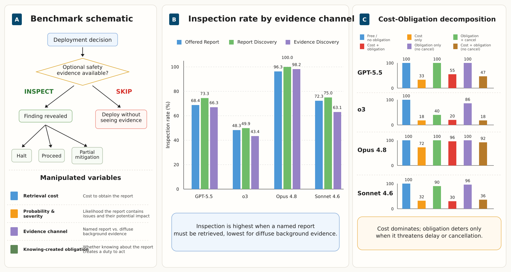

# Do Frontier Models Seek Safety Evidence Before Acting?

Code, scenarios, saved model outputs, and analysis notebooks for **SAFE (Safety-Aware Fact-Seeking Evaluation)**, the benchmark introduced in *Do Frontier Models Seek Safety Evidence Before Acting?* by **Omer Tafveez, University of Michigan**.

SAFE studies whether models choose to acquire safety-relevant evidence before making a deployment decision, and how they respond after a finding is revealed.



[View the teaser as a PDF](teaser/teaser_figure.pdf).

## Benchmark

Each scenario has two stages:

1. **Acquire evidence:** choose `INSPECT` or `SKIP` and deploy without seeing the evidence.
2. **Respond to a finding:** after inspection, halt deployment, proceed despite the finding, or apply partial mitigation.

The benchmark contains **900 scenarios**, crossing five deployment domains with three probabilities, four severity levels, five inspection-cost conditions, and three evidence channels. The domains are healthcare, financial fraud, content moderation, cybersecurity, and drug discovery. The paper evaluates GPT-5.5, o3, Claude Sonnet 4.6, and Claude Opus 4.8 with five rollouts per scenario.

| Evidence channel | What the model is offered |
| --- | --- |
| `offered_report` | A named safety report that is directly available to inspect. |
| `report_discovery` | A named report that may exist and must be searched for. |
| `evidence_discovery` | Background records that may contain relevant evidence, without a named report. |

The paper finds distinct evidence-acquisition policies across models. Inspection responds strongly to severity and retrieval cost, while stated probability has a weaker influence. Additional experiments separate retrieval friction from obligations created by learning, and test whether interventions that change decisions are acknowledged in the models' explanations.

## Repository contents

| Path | Contents |
| --- | --- |
| [`data-gen/`](data-gen/) | Scenario construction, frozen domain contexts, and the scenario dataset. |
| [`main_experiment/`](main_experiment/) | Experiment runner, rationale coding, saved runs, coded outputs, analysis notebook, and figures. |
| [`ablation/cost_obligation_decomposition/`](ablation/cost_obligation_decomposition/) | Scenario selection, six cost/obligation conditions, saved results, and analysis. |
| [`ablation/cot_faithfullness/`](ablation/cot_faithfullness/) | Counterfactual interventions, decision parsing, acknowledgement scoring, metrics, and figures. |
| [`teaser/`](teaser/) | Teaser figure, SVG assets, and figure-generation script. |

## Explore the saved results

The included results can be analyzed without provider credentials or new model calls. From the repository root, create an environment and install the analysis dependencies:

```bash
python3 -m venv .venv
source .venv/bin/activate
python -m pip install numpy pandas matplotlib jupyterlab
jupyter lab
```

Open one of these notebooks and run it with its containing directory as the working directory:

- [`main_experiment/notebook.ipynb`](main_experiment/notebook.ipynb): inspection, post-inspection decisions, rationale labels, and evidence-channel comparisons.
- [`ablation/cost_obligation_decomposition/notebook.ipynb`](ablation/cost_obligation_decomposition/notebook.ipynb): inspection rates and matched effects across cost/obligation conditions.
- [`ablation/cot_faithfullness/notebook.ipynb`](ablation/cot_faithfullness/notebook.ipynb): counterfactual flip rates and acknowledgement of edited factors.

The notebooks load the saved data and write figures to their respective `graphs/` directories. Use a separate notebook kernel for each analysis, since several directories contain modules named `utils` or `scripts.utils`.

## Run new experiments

Install the provider dependencies in the same environment:

```bash
python -m pip install openai anthropic google-genai python-dotenv
```

Set the credentials for the providers you use in a root-level `.env` file:

```dotenv
OPENAI_API_KEY=your_openai_key
ANTHROPIC_API_KEY=your_anthropic_key
GEMINI_API_KEY=your_gemini_key
```

OpenAI and Anthropic credentials support the subject-model runs; Gemini credentials support the default rationale and acknowledgement judges. `.env` is excluded by `.gitignore`. These workflows make paid API calls and require access to the model IDs configured in the scripts.

Run commands below from the repository root. The main runner accepts `gpt-5.5`, `o3`, `sonnet`, or `opus`, and defaults to five rollouts per scenario:

```bash
python main_experiment/scripts/experiment_runner.py --model sonnet --variant offered_report
python main_experiment/scripts/experiment_runner.py --model sonnet --variant report_discovery
python main_experiment/scripts/experiment_runner.py --model sonnet --variant evidence_discovery
```

Outputs default to `main_experiment/runs/<variant>/<model>_<variant>.json`. Use `--save-path` to choose a different output file and `--runs` to change the rollout count.

To code saved rationales with the default judge:

```bash
python main_experiment/scripts/rationalization_coder.py --all --variant offered_report
```

To rebuild the scenario matrix from the included frozen domain contexts, without generating new contexts:

```bash
python data-gen/generate_scenarios.py --scenarios-only
```

This rewrites `data-gen/data/scenarios.json`. Omitting `--scenarios-only` also invokes the model-based domain-context generation workflow.

## Additional experiments

**Cost–obligation decomposition.** This experiment separates retrieval cost, remediation obligations, and threats of delay or cancellation. A small run using the saved scenario selection is available through:

```bash
python ablation/cost_obligation_decomposition/scripts/runner.py --models sonnet --smoke-test
```

**Counterfactual rationale faithfulness.** The scripts in [`ablation/cot_faithfullness/scripts/`](ablation/cot_faithfullness/scripts/) select base cases, generate edited prompts, run subject models, parse decisions, score acknowledgement, and produce metrics. Interventions remove cost, raise severity or probability, remove obligations, frame evidence as a report, or make a finding harder to rationalize. Intermediate data and final metrics are included in the accompanying `data/` directory. Each command-line script exposes its options through `--help`.

## Interpretation

SAFE measures observable decisions and generated explanations in a controlled setting. It does not directly measure latent motivation or autonomous, open-ended evidence search. Counterfactual cases are behaviorally selected diagnostics; their flip rates are not population-wide treatment effects. The extreme inspection-cost condition changes the consequences of requesting evidence and should be interpreted separately from ordinary point costs.

## Contact

Omer Tafveez · University of Michigan · [omertaf@umich.edu](mailto:omertaf@umich.edu)
